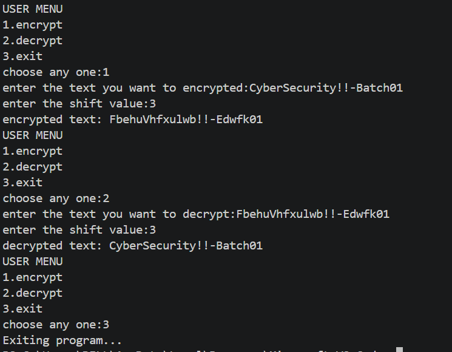

# 🔐 PRODIGY_CS_01 - Caesar Cipher Encryption & Decryption using python

## 📌 Overview

This project is part of my **Cyber Security Internship at Prodigy InfoTech**.
It implements the **Caesar Cipher algorithm**, a basic encryption technique used in cryptography.
The program allows users to:
* Encrypt a message by shifting letters forward
* Decrypt a message by shifting letters backward
* Interact through a simple menu-driven interface

## 🚀 Features

* 🔒 Encrypt text using Caesar Cipher
* 🔓 Decrypt text using Caesar Cipher
* 🔤 Supports both uppercase and lowercase letters
* 🔁 Wrap-around logic using modulo arithmetic
* 🚫 Leaves numbers and special characters unchanged
* 🧭 User-friendly menu-driven program

## 🧠 Concepts Used

* ASCII value manipulation (`ord()` and `chr()`)
* Modular arithmetic (`% 26`)
* String iteration and manipulation
* Conditional statements and loops
* Function-based programming

## 🛠️ Technologies Used

* Python 3

## ▶️ How to Run the Program

1. Make sure Python is installed on your system
2. Download or clone this repository
3. Open terminal or command prompt
4. Run the program:
python caesar_cipher.py
5. Choose an option:
   * 1 → Encrypt
   * 2 → Decrypt
   * 3 → Exit
6. Enter the text and shift value as prompted

## 🧪 Example

🔹 Encryption

Input:

Text: hello
Shift: 2

Output:

Encrypted Text: jgnnq

🔹 Decryption

Input:

Text: jgnnq
Shift: 2

Output:

Decrypted Text: hello

## 📷 Output Screenshot

## 📚 Learning Outcomes

Through this project, I learned:
* Basics of cryptography and encryption techniques
* How Caesar Cipher works internally
* Importance of modular arithmetic in security
* Writing clean and structured Python code
* Building interactive command-line applications

## 🔮 Future Improvements

* Add GUI using Tkinter
* Support for file encryption
* Improve user interface
* Add more encryption algorithms

## 👩‍💻 Author

Harshini Yekkaldevi
Cyber Security Student

## 📎 Internship

This project was completed as part of the **Prodigy InfoTech Cyber Security Internship**.

